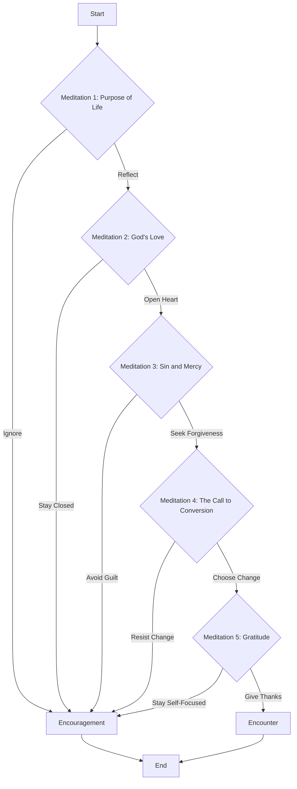

# Week5 - Software Development

## Lab 4: `Camino.java`

I came with this idea after a having a wonderful retreat where I learnt about St. Ignatius' spiritual excercises, the idea was designing the dinamic using nested `if` statements. It is a very engaging meditation over the gospels and it's worth to give it a try. You can see the flowchart with the processes involved.

Input (yes/no)
Output (string)

## Leap Year Lab

The logic for determining a leap year can be expressed in mathematical notation using set theory concepts:

Let:

A be the set of years divisible by 4.

B be the set of years not divisible by 100.

C be the set of years divisible by 400.

By definition given:

$$(A \cap B) \cup C$$

$$\{ x \in \mathbb{N} \mid (x \in A \cap B) \ \text{or} \ x \in C \}$$

*This notation represents the condition: A year is divisible by 4 and not divisible by 100, or it is divisible by 400.*

This file is also available in GitHub [Link to Week5 Public Repo](http://github.com/alanmaizon/Software-Development/blob/main/Week5/)