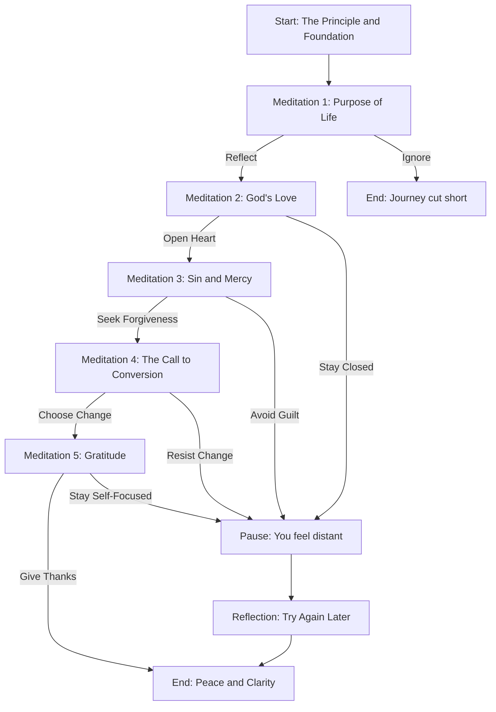

# Week5 - Software Development

## Lab 4

I came with this idea after a retreat about St. Ignatius spiritual excercises, the idea of designing a game dinamic using nested if statements. It is a very personal project and its exciting. I want to make this challenge the pilot version of a future complete version of this idea.

## Leap Year Lab

The logic for determining a leap year can be expressed in mathematical notation using set theory concepts:

Let:

A be the set of years divisible by 4.

B be the set of years not divisible by 100.

C be the set of years divisible by 400.

By definition given:

$$(A \cap B) \cup C$$

$$\{ x \in \mathbb{N} \mid (x \in A \cap B) \ \text{or} \ x \in C \}$$

This notation represents the condition: A year is divisible by 4 and not divisible by 100, or it is divisible by 400.
