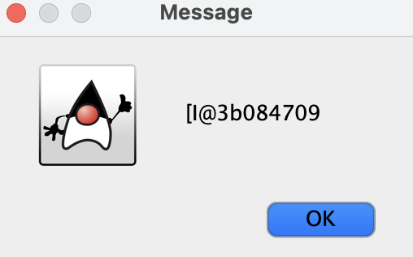

# Week 7 - Software Development

## Question 2:

Alter the guessing game application so that every time it plays the user is asked do they want to play again. Depending on what the user enters the application should keep going until they wish to stop.


Bonus: store the user guesses and return them to the user when they finish or win.
Note this may necessitate the creation of a large blank array

`Random.java`
`RandomApp.java`

Declared a boolean variable `tryAgain=true` to control a while loop for repeating the game.

Imported JOptionPane and used its dialog functions to display messages and capture user input with a custom title that looks nice, and the message type.

For example, using JOptionPane.showConfirmDialog with `JOptionPane.YES_NO_OPTION` allows the program to store `tryAgain` as a boolean-like value based on the user’s choice:

`JOptionPane.YES_OPTION (true)` or `JOptionPane.NO_OPTION (false)`.


For the bonus I needed to add an array of dimension 3:
`attempt[count]=userInput` to store the inputs and a `reset` method to restart `count=0`
That works just fine for our case. Encountered some issues and decided to learn about the utility library for Arrays and the specific function 
`Arrays.toString`

Here is what it happen when trying ```rd.getAttempts()``` with `showMessageDialog` when the array is made of integers:





Instead, the library provides a function to print a String  formatted as a series of comma separated numbers as a good vector:

$$A_{n} = [A_{0},A_{1},...,A_{n}]$$

That will replace the bug that came out when tying the method `rd.getAttempts()`

## Question 5:

Return the mean and sum of an array of numbers. Following the standard and good practices as showed in class.

`SumArray.java`

# Resources

https://docs.oracle.com/javase/8/docs/api/javax/swing/JOptionPane.html

https://docs.oracle.com/javase/8/docs/api/java/util/Arrays.html#toString-int:A-